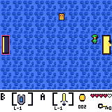
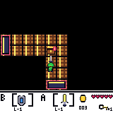
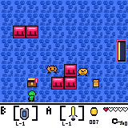

# NesyLink 数理逻辑课程设计报告

## 摘要

本项目面向 NesyLink 的五个数理逻辑关卡，实现了从原始 RGB 图像到符号状态、从符号状态到搜索规划、再到像素动作执行的统一 Agent。在此基础上，项目使用 Lean 4 形式化环境语义，并对策略安全性、搜索有界完备性、多房间记忆不变量和五关任务组合正确性进行了机器检查。

最终 Agent 使用共享入口 `submissions/student_policy.py`，正式推理只读取 `(128, 160, 3)` 的像素观测 `obs`、上一时刻标量奖励 `last_reward` 和公开物品栏 `inventory`。正式测评使用 `--info-mode safe --robustness-suite --num-envs 100 --seed 0`，共运行 500 个 episode；五个任务在 `original`、`spatial`、`color` 三个阶段的成功率均为 100%，总成功率为 **500/500 = 100%**。

## 1. 策略性能

### 1.1 Agent 整体方法与接口

提交入口 `submissions/student_policy.py` 实现了：

- `Policy`：五个任务共用的策略对象；
- `reset()`：每个 episode 重建 `AgentMemory` 和 controller；
- `act(obs, info)`：根据像素和 safe info 返回 `0..6` 的一个离散动作；
- `make_policy()`：供测评器创建 Policy。

整体数据流为：

```text
RGB obs + last_reward + inventory
              |
              v
静态 tile CNN + 动态 CenterNet + 跨帧/跨房间记忆
              |
              v
SymbolicState（玩家、墙、宝箱、出口、怪物、机关、资源）
              |
              v
任务阶段选择 + 单房间 BFS + 房间图 BFS
              |
              v
tile 路径 -> 像素动作队列 -> 环境
```

### 1.2 像素观测与符号状态

`submissions/state.py::SymbolicState` 使用 tile 坐标 `(x, y)`，其中 `x in 0..9`、`y in 0..7`，记录玩家位置和朝向、墙与地形、宝箱与出口类型、怪物、按钮、switch 和公开物品等规划信息。`AgentMemory` 记录跨帧玩家位置、怪物轨迹、动作队列、奖励历史、已访问房间、房间静态 belief、房间图、已尝试/受阻出口、按钮历史和 controller 阶段。

`vision_preprocess.py` 将 RGB 转换为 9 个通道：逐图标准化 RGB、亮度、水平梯度、垂直梯度、组合边缘以及两个色度通道。动态全图输入还会检测并规范化整帧反色，以适应 `grayscale`、`dark`、`bright`、`high_contrast` 和 `inverted` 变体。

静态网络 `vision_static_resnet.py` 将一帧分为 80 个 `16 x 16` tile，使用 74,799 参数的轻量残差 CNN 和五个输出头：

| Head    | 输出                                        |
| ------- | ------------------------------------------- |
| terrain | floor、wall、spike、abyss、gap、bridge      |
| object  | none、chest、npc、button、switch、exit      |
| chest   | key、gold、heal、item 等宝箱类型            |
| exit    | normal、locked-key、conditional             |
| state   | default、changed，用于开箱/按钮/switch 状态 |

动态网络 `vision_dynamic_resnet.py` 对整张 `(128, 160, 3)` 图像进行 CenterNet 风格的全卷积检测。68,026 参数的网络输出 player 和三类 monster 的中心热图、亚网格 offset 和玩家朝向。该方法不要求动态对象位于 tile 中心，当前检测阈值为 0.28。连通域颜色检测只在权重无法加载或玩家漏检时作为 fallback。

`vision.py` 最后将静态与动态结果融合：先检测动态对象，再消除前景遮挡引起的伪静态对象，并与房间 belief 融合。房间签名由墙布局与各方向出口类型组成；墙、出口和宝箱跨房间长期保留，trap/gap/bridge 使用当前观测，新增对象需要多帧确认。

### 1.3 视觉模型训练与权重

最终视觉模型使用 `submissions/training/generate_dataset.py` 在线生成监督样本。生成器调用游戏同源绘制函数产生 sprite，并随机化：

- terrain、宝箱类型/开闭、出口类型/开闭、按钮和 switch 状态；
- bridge 下方纹理以及角色局部/完全遮挡；
- 角色连续像素位置、朝向、剑盾动作姿态；
- 0--4 个不同类型怪物与随机静态干扰物；
- 六种颜色变换，并将出口作为动态检测的 hard negative。

静态标签由生成器直接产生五个 head 的监督目标；动态标签由中心热图、offset mask 和 facing target 组成。训练不需要人工逐帧标注，也不把环境隐藏 `info` 作为模型输入。

| 模型                 | Optimizer | Batch |     LR | Steps |       Seed | Loss                                                  |
| -------------------- | --------- | ----: | -----: | ----: | ---------: | ----------------------------------------------------- |
| static multitask CNN | AdamW     |   192 |  0.002 |   400 | 2026071801 | 五个 head 的交叉熵，状态 head 权重 0.7                |
| dynamic CenterNet    | AdamW     |    24 | 0.0015 |   350 |   20260718 | focal heatmap + 2.0 offset Smooth-L1 + 0.35 facing CE |

正式运行时实际加载的权重为：

| 文件                                |          大小 | SHA-256                                                              |
| ----------------------------------- | ------------: | -------------------------------------------------------------------- |
| `models/static_tile_multitask.pt` | 318,515 bytes | `5F6A4995EEC825D2BD810050656D7FFE7DB41B8258A288CBF78259D54EF5FFF9` |
| `models/dynamic_centernet.pt`     | 294,645 bytes | `9A67BCD1D57473EF34859D61303B4B8A399632240B2E7A0C72B588A24B3B7A46` |

训练脚本在 CUDA 可用时可使用 GPU；正式 500-episode 结果使用 CPU 推理，且 episode 之间不更新权重。

### 1.4 搜索、记忆与任务策略

`planner.py::bfs_path` 在四邻接 tile 图上运行 BFS，并通过 parent map 重建最短 tile 路径。安全格排除越界位置、墙、NPC、怪物、宝箱、未被活动桥覆盖的 trap/gap，以及视觉置信度不足的 uncertain tile。宝箱、怪物和 switch 的交互目标为其周围安全邻接格；到达后 controller 先调整朝向，再执行 `ACTION_A`。

每条相邻 tile edge 被编码为同方向的 16 个像素动作。planner 结合玩家像素中心完成 tile 对齐、墙角净空调整、出口穿越确认以及碰撞后的局部恢复。Task 3 每执行一条 tile edge 就重新观测，避免换房或动态状态变化后继续执行过期路径。

Task 3--5 在线建立有向房间图，节点是视觉识别的房间，边记录出口方向和目标房间。Agent 区分已探索边、未探索 frontier、当前受阻边、key-gated 边和获得资源后可重试边。房间级 BFS 用于寻找包含未探索出口、switch、bridge 或待重试出口的最近已知房间；空间变体中的图会在当前 episode 重新建立，不依赖固定房间编号。

五个 controller 共用同一视觉、符号状态和 planner，仅在高层子目标优先级上区分：

| Controller | 高层优先级                                                                        |
| ---------- | --------------------------------------------------------------------------------- |
| Task 1     | 无钥匙时打开钥匙宝箱；有钥匙后前往锁门                                            |
| Task 2     | 怪物优先；随后开钥匙宝箱；最后进入条件出口                                        |
| Task 3     | 当前房间怪物优先；取钥匙；探索 frontier；有钥匙后重试 key-gated 出口              |
| Task 4     | 宝箱优先；有剑后战斗；检查桥状态；操作 switch；继续房间图探索                     |
| Task 5     | 危险窗口举盾；key chest 优先；处理其余宝箱和按钮；探索 frontier；资源变化后重试门 |

因此，策略的任务差异是可解释的阶段优先级，而不是针对某张地图记忆固定坐标或动作序列。

### 1.5 正式测评设置

最终结果使用课程文档指定的 safe 鲁棒性套件生成。实际命令为：

```powershell
python utils/evaluate_policy.py `
  --policy submissions/student_policy.py `
  --info-mode safe `
  --robustness-suite `
  --num-envs 100 `
  --seed 0 `
  --json-out results/robustness_suite_eval_final.json
```

完整实验元数据如下：

| 项目             | 实际设置                                             |
| ---------------- | ---------------------------------------------------- |
| policy           | `submissions/student_policy.py`，五关共享策略      |
| observation      | pixels，`uint8 (128, 160, 3)`                      |
| info mode        | `safe`                                             |
| seed             | `0`；各分组 episode seed 由测评脚本按计划生成      |
| episode 数       | 每个 Task 100，总计 500                              |
| robustness split | original 60%、spatial 30%、color 10%                 |
| spatial          | `spatial_a/b/c` 各 10 次                           |
| color            | grayscale/dark/bright/high_contrast/inverted 各 2 次 |
| max_steps        | 未覆盖，使用任务默认值 500/500/1500/2000/2000        |
| action_repeat    | 未覆盖，使用默认值 1                                 |
| 额外训练         | 无，测评期间仅推理                                   |
| 推理设备         | CPU                                                  |
| 代码版本         | Git`f567418901ce3b6da16c6171cea3c891333bcdae`      |

由于视觉部分使用训练权重，测试环境需要安装 PyTorch。推荐使用已通过完整测评验证的版本组合：

| 环境/安装包 | 推荐版本    | 说明                                                                             |
| ----------- | ----------- | -------------------------------------------------------------------------------- |
| Python      | `3.10.20` | 项目要求 Python`>=3.10`                                                        |
| PyTorch     | `2.8.0`   | 完整测评环境为`2.8.0+cu126`；当前 Agent 使用 CPU 推理，同版本 CPU 构建也可使用 |
| NumPy       | `2.2.6`   | 用于观测数组和视觉预处理                                                         |
| Gymnasium   | `1.3.0`   | 用于环境与测评接口                                                               |
| PyYAML      | `6.0.3`   | 用于读取任务配置                                                                 |

CUDA 仅用于可选的 GPU 训练或推理加速，不是复现本报告测评结果的必要条件。一个 episode 仅在 `world_completed` 成立时记为成功；milestone 和 progress 用于分析子任务，不代替最终成功率。

### 1.6 成功率、步数与奖励

| Task           |      Episodes |        成功数 |         成功率 |        avg_steps |        avg_reward |
| -------------- | ------------: | ------------: | -------------: | ---------------: | ----------------: |
| Task 1         |           100 |           100 |           100% |           256.40 |           127.386 |
| Task 2         |           100 |           100 |           100% |           191.30 |           150.182 |
| Task 3         |           100 |           100 |           100% |          1221.10 |           197.734 |
| Task 4         |           100 |           100 |           100% |          1234.12 |           260.748 |
| Task 5         |           100 |           100 |           100% |          1101.74 |           153.928 |
| **总计** | **500** | **500** | **100%** | **800.93** | **177.995** |

| Task   | Stage    | Episodes | Success rate | avg_steps | avg_reward |
| ------ | -------- | -------: | -----------: | --------: | ---------: |
| Task 1 | original |       60 |         100% |    290.00 |    127.050 |
| Task 1 | spatial  |       30 |         100% |    178.00 |    128.170 |
| Task 1 | color    |       10 |         100% |    290.00 |    127.050 |
| Task 2 | original |       60 |         100% |    189.00 |    151.110 |
| Task 2 | spatial  |       30 |         100% |    196.67 |    148.017 |
| Task 2 | color    |       10 |         100% |    189.00 |    151.110 |
| Task 3 | original |       60 |         100% |   1216.00 |    197.190 |
| Task 3 | spatial  |       30 |         100% |   1229.33 |    199.040 |
| Task 3 | color    |       10 |         100% |   1227.00 |    197.080 |
| Task 4 | original |       60 |         100% |   1143.00 |    256.570 |
| Task 4 | spatial  |       30 |         100% |   1444.00 |    270.493 |
| Task 4 | color    |       10 |         100% |   1151.20 |    256.578 |
| Task 5 | original |       60 |         100% |   1085.00 |    156.050 |
| Task 5 | spatial  |       30 |         100% |   1127.00 |    150.247 |
| Task 5 | color    |       10 |         100% |   1126.40 |    152.236 |

### 1.7 Milestone 与 Progress

Task 1 和 Task 2 没有测评器单独定义的 `milestone_rates`，其关键事件列在 progress 中。Task 3--5 的 milestone 如下：

| Task/Stage      | Milestone rates                                                                                                                            |
| --------------- | ------------------------------------------------------------------------------------------------------------------------------------------ |
| Task 3 original | `monster_killed=100%`, `key_collected=100%`                                                                                            |
| Task 3 spatial  | `monster_killed=100%`, `key_collected=100%`                                                                                            |
| Task 3 color    | `monster_killed=100%`, `key_collected=100%`                                                                                            |
| Task 4 original | `switch_activated=100%`, `key_collected=100%`, `door_opened=100%`, `item_collected=100%`, `monster_killed=100%`                  |
| Task 4 spatial  | 上述五项均为 100%                                                                                                                          |
| Task 4 color    | 上述五项均为 100%                                                                                                                          |
| Task 5 original | heal/button/chest/door/environment/exit/gold/key/room/world 均 100%；`monster_killed=100%`, `item_collected=0%`, `trap_triggered=0%` |
| Task 5 spatial  | 核心完成项均 100%；`monster_killed=33.33%`, `item_collected=0%`, `trap_triggered=0%`                                                 |
| Task 5 color    | 核心完成项均 100%；`monster_killed=60%`, `item_collected=0%`, `trap_triggered=0%`                                                    |

Task 5 的目标是探索并打开所有宝箱，不要求清空怪物。因此 `monster_killed` 在 spatial/color 中低于 100% 不影响 `world_completed`。`trap_triggered=0%` 是期望的安全结果。Task 5 公开地图的宝箱内容为钥匙、金币或治疗，不存在 `loot.kind == "item"` 的装备宝箱，所以 `item_collected=0%` 是测评器按固定事件列表自动生成的正常结果。

JSON 中的所有非空 progress 指标如下：

| Task/Stage      | Progress rates                                                                                                                                                                       |
| --------------- | ------------------------------------------------------------------------------------------------------------------------------------------------------------------------------------ |
| Task 1 三阶段   | chest_opened、door_opened、environment_completed、exit_reached、key_collected、room_changed、world_completed 均为 100%                                                               |
| Task 2 三阶段   | chest_opened、environment_completed、exit_reached、key_collected、monster_killed、room_changed、world_completed 均为 100%                                                            |
| Task 3 三阶段   | chest_opened、door_opened、environment_completed、exit_reached、key_collected、monster_killed、room_changed、world_completed 均为 100%                                               |
| Task 4 三阶段   | chest_opened、door_opened、environment_completed、exit_reached、gold_collected、item_collected、key_collected、monster_killed、room_changed、world_completed 均为 100%               |
| Task 5 original | agent_healed、button_pressed、chest_opened、door_opened、environment_completed、exit_reached、gold_collected、key_collected、monster_killed、room_changed、world_completed 均为 100% |
| Task 5 spatial  | 除`monster_killed=33.33%` 外，上述核心完成事件均为 100%                                                                                                                            |
| Task 5 color    | 除`monster_killed=60%` 外，上述核心完成事件均为 100%                                                                                                                               |

`progress_rates` 只显示至少在一个 episode 中发生过的事件。`agent_dead` 未出现在任何正式分组中，即 500 个 episode 没有记录到玩家死亡。所有阶段的 `world_completed` 和 `environment_completed` 都为 100%，与成功率一致。

### 1.8 结果分析

- Task 1/2 在空间和颜色变化下均保持 100%，说明策略不是固定动作回放，宝箱、怪物和出口类型可以从变化后的图像中恢复。
- Task 3 三阶段均为 100%，代价是平均约 1221 步。共享 Agent 需要在线探索出口、确认房间切换、记录钥匙门并在取得钥匙后回溯，而不是使用公开地图上的最短固定路线。其最大步数为 1500，三个阶段仍全部完成。
- Task 4 的 `spatial` 平均步数最高（1444），因为 bridge/switch 组合和房间布局变化需要更多探索；30 个空间变体仍全部完成。
- Task 5 通过 key chest、按钮、房间 frontier、门重试和盾牌保护完成所有宝箱。部分变体不需要击杀怪物，体现了任务目标导向而非无条件战斗。
- 五种颜色变体在所有五关上均成功，说明颜色稳健预处理、数据增强、动态检测和时序记忆共同覆盖了正式颜色套件。

### 1.9 运行证据与结果附件

正式原始结果附件：[`robustness_suite_eval_final.json`](./robustness_suite_eval_final.json)，SHA-256 为：

```text
12C073E626AF77A56A88B0DD97249596503BB849DCFED613BE18F6CDD017B460
```

运行终局截图：

| Task 3                                                    | Task 4                                                    | Task 5                                                    |
| --------------------------------------------------------- | --------------------------------------------------------- | --------------------------------------------------------- |
|  |  |  |

JSON 包含全部 500 个 episode 的 task、stage、obs/map variant、seed、steps、reward、success、terminal reason、事件计数和 milestone，可独立核对上述汇总结果。

## 2. 环境形式化

### 2.1 形式化方法

环境形式化将 Python 模拟器中的对象、状态、动作、交互规则和任务目标抽象为 Lean 中的数据类型、函数和谓词。主要实现位于 `submissions/lean/Environment.lean`，并统一放在命名空间 `NesyLink` 中。

| Lean 抽象                 | 环境含义                                  |
| ------------------------- | ----------------------------------------- |
| `State`                 | 房间、玩家、对象、资源、机关与任务进度    |
| `walkable` / `isSafe` | 引擎的可通行性与 planner 使用的更强安全性 |
| `Step`                  | 一次环境动作的状态转移关系                |
| `Exec`                  | 由多个单步转移组成的执行轨迹              |
| `TaskGoal`              | 五个任务的最终完成条件                    |

### 2.2 状态、对象与目标

`Environment.lean` 定义了 `Direction`、七种 `Action`、六类 `ChestKind`、三类 `ExitKind`、三类 `MonsterKind`、两种 `BridgeMode` 和五个 `TaskId`。`State` 显式记录：

- 房间、玩家 tile、朝向、HP 和最大 HP；
- 钥匙、金币、剑、盾和事件计数；
- walls、traps、gaps、NPC；
- chests/openedChests、exits、monsters；
- buttons/pressedButtons、switches/activatedSwitches；
- 水平/垂直 bridge 与当前桥状态；
- visitedRooms、worldChestsRemaining 和 worldCompleted。

`walkable` 表示环境引擎的可通行性，`isSafe` 表示更严格的安全条件。陷阱和未被桥覆盖的 gap 可能被环境允许进入，但不满足 `isSafe`；活动 bridge 可以覆盖同一 tile 上的危险。

`TaskGoal` 将五关目标抽象为：

- Task 1：完成世界且收集过钥匙；
- Task 2：完成世界、击杀怪物并收集钥匙；
- Task 3：在 Task 2 里程碑基础上访问至少两个房间；
- Task 4：完成世界、取得钥匙和剑、击杀怪物并获得金币；
- Task 5：完成世界、打开所有世界宝箱，并完成钥匙、金币和按钮里程碑。

### 2.3 状态转移

关系 `Step s a t` 描述从状态 `s` 执行动作 `a` 后到达状态 `t`，覆盖：

- `moveSafe`、`moveDanger`、`moveBlocked`；
- `monsterDamage`、`attackDamage`、`attackKill`；
- `openChest`、`activateSwitch`、`pressButton`；
- `attackNoEffect`、`wait`、`shield`；
- `crossExit`：检查出口条件、消耗钥匙、切换房间并更新完成状态。

`Exec` 递归连接多步 `Step`，`exec_append` 证明两段合法轨迹可以组合，为后续任务策略证明提供基础。

### 2.4 环境形式化结果

| 类别       | 已证明性质                                                                                                                                                                                                                          |
| ---------- | ----------------------------------------------------------------------------------------------------------------------------------------------------------------------------------------------------------------------------------- |
| 移动与危险 | `safe_implies_walkable`、`selected_safe_move_is_environment_step`、`selected_shield_preserves_health`、`uncovered_gap_is_not_safe`、`active_bridge_covers_hazards`                                                        |
| 门与机关   | `locked_exit_requires_key`、`conditional_exit_requires_trigger`、`locked_exit_consumes_one_key`、`selected_button_press_records_event`、`selected_switch_toggles_bridge`、`selected_switch_changes_bridge_mode`         |
| 宝箱与完成 | `key_chest_effect`、`gold_chest_effect`、`sword_chest_effect`、`every_chest_records_progress`、`crossing_completing_exit_finishes_world`、`opening_victory_chest_finishes_world`、`opening_last_chest_finishes_world` |
| 单调不变量 | `step_*_mono` 与 `exec_*_mono`：已开宝箱、击杀数、按钮事件、金币和剑等关键进度不回退                                                                                                                                            |

环境形式化已覆盖对象、属性、状态、动作、转移规则和目标谓词，并对锁门、条件门、陷阱、桥、按钮、switch、宝箱和任务完成等关键机制给出了可检查性质。

## 3. 策略形式化与证明

### 3.1 形式化范围

`submissions/lean/Strategy.lean` 形式化感知契约、action mask、路径编码、可执行 bounded BFS 和房间记忆；`submissions/lean/TaskProofs.lean` 证明环境机制、阶段优先级与五关组合正确性。本部分形式化第 1 节中已经说明的稳定符号接口，不重复展开 CNN 结构或 controller 工程细节。

| Lean                              | 所验证的策略层                   |
| --------------------------------- | -------------------------------- |
| `PerceptionContract`            | 视觉输出到真实符号状态的感知契约 |
| `isSafe` / `ActionAllowed`    | 安全格和 action mask             |
| `BFSReturns` / `bfsVisited`   | 路径合法性和有界可达性           |
| `RoomMemory` / `bfsRooms`     | 多房间记忆与房间图搜索           |
| `ActionsFollowPath`             | tile 路径到移动动作的编码        |
| `task1Phase` ... `task5Phase` | 五个任务的高层阶段优先级         |

### 3.2 感知契约与 Action Mask

Lean 不证明神经网络对所有图像都识别正确，而是使用 `PerceptionContract observed actual` 表达感知边界：

- 观测玩家位置与真实符号位置一致；
- 真实墙、trap、gap、NPC、宝箱和怪物不能被安全层漏报；
- 被观测为活动 bridge 的 tile 必须在真实状态中活动；
- 允许保守地多报障碍，因为这只影响可达性，不破坏安全性。

`ActionAllowed` 要求移动目标安全、攻击前存在可攻击/交互对象、使用盾牌前已经持盾；`maskedAction` 将不符合规范的候选动作替换为 `wait`。`perceived_safe_is_actually_safe` 证明在契约成立时，观测状态中的安全 tile 在真实状态中也安全；`masked_move_is_safe_for_actual_state` 将该结论连接到 action mask。

### 3.3 BFS 与房间记忆

`plannerStep`、`runMoves`、`expandFrontier`、`bfsVisited` 和 `bfsVisitedFrom` 是可计算的 Lean 定义。所证明的核心性质为：

1. planner 执行的每一步保持安全；
2. 长度不超过 `depth` 的合法移动计划，其终点一定出现在 bounded BFS 的 visited 中；
3. 如果深度界内存在到任一目标的路径，BFS 一定发现目标。

同一性质通过 `bfsRooms` 推广到房间图。`record_transition_preserves_consistency` 证明记录换房后，当前房间、visited 集合和房间边仍然保持一致。Lean BFS 证明给定深度内不遗漏可达状态，不对 Python parent map 的最短路径重建做等价性声称。

### 3.4 策略证明结果

| 类别             | 已证明定理                                                                                                                                                                                                                                                                                       |
| ---------------- | ------------------------------------------------------------------------------------------------------------------------------------------------------------------------------------------------------------------------------------------------------------------------------------------------ |
| 感知契约与安全层 | `perceived_safe_is_actually_safe`、`masked_action_allowed`、`allowed_move_targets_safe`、`verified_move_preserves_safe_state`、`masked_move_is_safe_for_actual_state`                                                                                                                  |
| 路径编码         | `bfs_return_starts_at_player`、`bfs_return_ends_in_goal`、`bfs_return_path_safe`、`bfs_return_path_adjacent`、`encoded_tile_step_is_move`、`encoded_tile_step_adjacent`、`actions_for_path_are_moves`、`actions_follow_adjacent_path`                                            |
| BFS              | `planner_step_safe`、`run_moves_safe`、`planner_step_mem_expand`、`run_moves_mem_bfs`、`bfs_complete_for_bounded_goal`、`room_exec_mem_bfs`、`room_bfs_complete`                                                                                                                   |
| 房间记忆         | `record_transition_current`、`record_transition_preserves_consistency`、`task345_room_search_complete`                                                                                                                                                                                     |
| 阶段优先级       | `task1_collects_before_exit`、`task2_monster_has_priority`、`task3_monster_has_priority`、`task4_attacks_only_with_sword`、`task4_switch_after_bridge_inspection`、`task5_danger_selects_shield`、`task5_key_chest_precedes_optional_targets`、`task5_button_after_local_chests` |
| 五关组合正确性   | `task1_strategy_completes`、`task2_strategy_completes`、`task3_strategy_completes`、`task4_strategy_completes`、`task5_strategy_completes`                                                                                                                                             |

五个主定理使用实际 `Step` constructor 构造开箱、击杀、按钮、旋桥和出口转移，并用 `Exec` 拼接 planner 子路径。其结论是：只要感知/规划边界提供满足前提的合法子路径，各任务阶段就可以组合成满足 `TaskGoal` 的最终轨迹。

### 3.5 证明边界与机器检查

1. **视觉边界**：不证明 CNN 对所有 RGB 输入都正确；视觉正确性由 `PerceptionContract` 表达，并由正式端到端鲁棒性测评提供经验支持。
2. **Python/Lean 边界**：不证明 Python 源码逐行等价于 Lean；Lean 形式化的是符号环境、策略契约、planner 和关键阶段优先级。
3. **像素执行**：Lean 将成功对齐后的 16 个同方向像素动作抽象为一条 tile edge；子 tile 对齐、碰撞恢复和动画时序留在 Python。
4. **怪物战斗**：环境模型区分多次伤害和最终击杀；总任务定理在最后一击可执行的状态处组合战斗里程碑。
5. **搜索完备性**：证明的是给定 `depth` 内的有界完备性，不声称无限地图完备。
6. **地图变体**：总定理不固定对象坐标或房间编号，而以合法子路径和房间图可达性为前提。
7. **保守感知**：误报障碍可能使路径不存在或效率降低，但在 `PerceptionContract` 下不会使 planner 主动进入真实危险 tile。

形式化文件使用以下命令进行机器检查：

```powershell
lake build
lake env lean submissions\lean\Environment.lean
lake env lean submissions\lean\Strategy.lean
lake env lean submissions\lean\TaskProofs.lean
```

`lake build` 结果为 `Build completed successfully (5 jobs)`。Lean 版本为 4.29.0，commit 为 `98dc76e3c0a9b856c9b98726b713fb04fab16740`；提交的 Lean 源文件不包含 `sorry`、`admit` 或自定义 `axiom`。

综上，Python Agent 的具体实现与端到端性能在第 1 节给出；第 2 节独立说明环境语义的抽象与性质；本节则证明感知契约之后的安全层、搜索、记忆和任务组合性质，三部分之间的责任边界明确。
